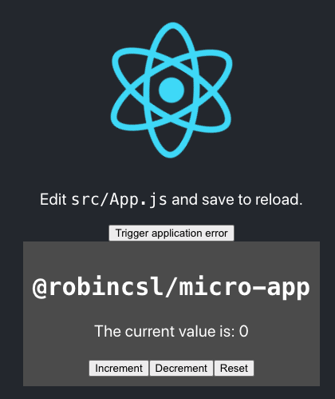

# Sentry in React micro-frontends

_Disclaimer_: This an attempt at using this section of Sentry docs about [managing several Sentry instances without any conflicts between them](https://docs.sentry.io/platforms/javascript/advance-settings/#using-a-client-directly).

_Disclaimer #2_: Micro-frontend is understood in a broad sense when two (or more) teams deliver part of a frontend application that need to be composed into a common frontend. To ensure proper ownership and independence of the teams, they should only be forwarded the application errors in their Sentry project.

## Content of this repository

This repository was bootstrapped with Lerna, though Yarn workspaces would actually be enough. It contains 3 packages:

- `micro-app`, which exports a React component claiming to be a whole application itself;
- `react-app`, which is a Create React App bootstrapped React application, with [Craco](https://github.com/gsoft-inc/craco) instead of `react-scripts` to allow transpiling within the monorepo -- it consumes the `micro-app`;
- `sentry`, which is just a thin layer of convenience components and utilities to use Sentry.

## Getting started

To see what is achieved in these examples, there are two options:

1. You can have a look at the deployed `react-app`:
  - using `Sentry.init`: [Live Demo](https://robincsl-sentry-in-react-micro-fe-sentry-init.netlify.app/)
  - using an error boundary with a hub [Live Demo](https://robincsl-sentry-in-react-micro-fe-error-boundary.netlify.app/)

(See `packages/react-app/index.js` for more details)

2. You can clone the repo

```bash
git clone git@github.com:RobinCsl/sentry-in-react-micro-fe.git
```

install dependencies

```bash
yarn
# or
npm install
npm run bootstrap
```

and finally, run the application on http://localhost:3000:

```bash
yarn dev
# or
npm run dev
```

## Instructions

After going through the [Getting Started](#getting-started) section, you should see the following application in your browser:



Open your DevTools (e.g. by pressing <kbd>F12</kbd>) and go to the Console tab.

There are two ways you can simulate application errors:
- by pressing the Increment button so that the value is increased to 5
- or by pressing the aptly named "Trigger application error" button.

As the "design" suggests, the application error coming from increasing the counter to 5 belongs to `@robincsl/micro-app` package from the `packages/micro-app` folder. As such, the error is "reported" only to the Sentry project for `@robincsl/micro-app`, which is initialised in `packages/micro-app/index.js`. After pressing 5 times on the increment button, you can see in the browser console that the error is logged and prefixed with `@robincsl/micro-app`. This comes from initialising the Sentry client with

```js
const client = new Sentry.client({
  dsn: "__DSN__",
  beforeSend(event) {
    console.log("my prefix of choice for this client", event)

    // Prevent the event from being sent to Sentry
    return null
  }
})
```

What's more, if you close the React development overlay for errors, you can still trigger an application error for the main application, by pressing the button with label "Trigger application error". You should see in the console that the event was also logged and it is prefixed with `react-app`.

> Note: The _Report feedback_ buttons don't work on the deployed app because the Sentry DSNs used in these examples are obtained from a local instance of Sentry. See the [getsentry/onpremise](https://github.com/getsentry/onpremise) repository for more information about that.

## TODO

- add a Next.js example, by adapting [Adam Wathan's blog post](https://adamwathan.me/2019/10/17/persistent-layout-patterns-in-nextjs/) for persisting layout in Next.js to wrap the Next.js pages with the right error boundary
